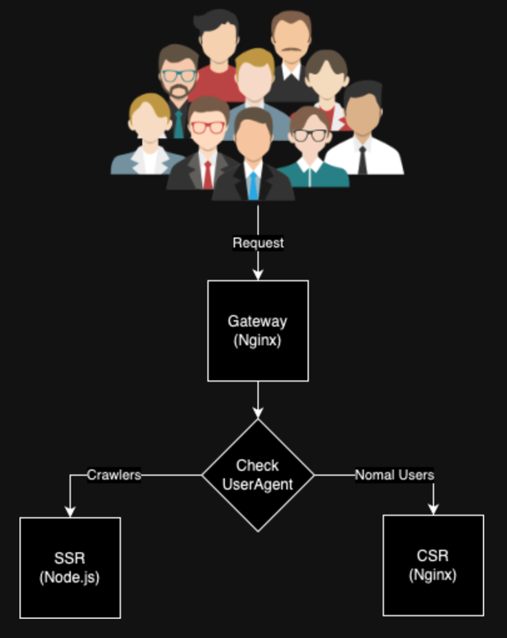

# Intro
This is a basic boilerplate using next.js that effectively employs dynamic rendering.
It allows you to have both client-side rendering (CSR) and server-side rendering (SSR) simultaneously with the same code.
You can direct some requests to SSR and others to CSR to reduce your CPU costs.

# How to run?
Just run `docker-compose up` and your application will be ready on 80 port.